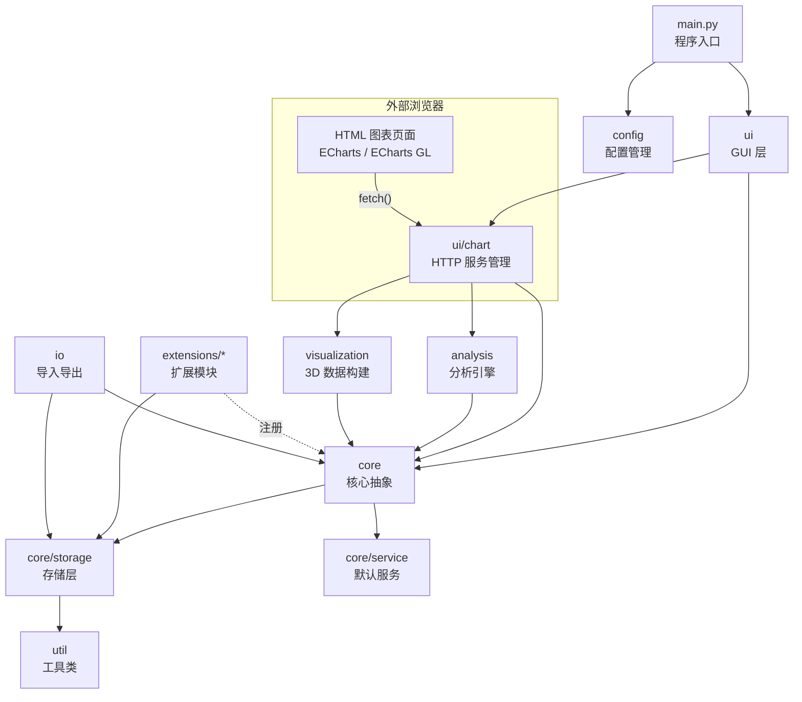

# 架构总览

> 本文档作为项目架构的导航索引，展示各目录的职责设计与模块划分。

## 设计哲学与准则

核心架构思想与开发准则

- [设计哲学](./design/design-philosophy.md)（待完善）
- [开发准则](./design/development-principles.md)（待完善）

## 项目结构

所有目录均位于 `src/` 下，与根目录的旧软件代码隔离：

### 核心抽象
> _./src/core_

框架层，定义系统的抽象基类、注册机制和通用工具。**此包不包含任何具体记录类型的业务逻辑。** 所有具体实现（包括内置的 default、timer、account）均为扩展模块。

- [抽象基类](./core/abstract.md)：`BaseTask`、`BaseTasker`——所有扩展模块的继承根
- [ExtensionRegistry](./core/extension-registry.md)：扩展注册表
  - `task_types: dict[str, Type[BaseTask]]`——"default" → DefaultTask，"timer" → TimerTask
  - `tasker_types: dict[str, Type[BaseTasker]]`——"default" → DefaultTasker
  - `analyzers: dict[str, Type[BaseAnalyzer]]`——"attr_count" → AttributeCounter
  - `chart_pages: dict[str, str]`——"attr_count" → "extensions/default/charts/attr_count.html"
- [BaseService](./core/base-service.md)：`BaseTaskerService`、`BaseTaskService`——CRUD 操作的抽象接口
- [数据类型](./core/types.md)：`TaskDict`、`TaskerDict`、`SearchQuery` 等 TypedDict / dataclass——各层间传递数据而不依赖具体类

### 存储层
> _./src/core/storage_

负责 JSON 文件的分段读写与索引维护。所有扩展模块通过本层的接口读写数据，不直接操作文件。

- [StorageManager](./core/storage/storage-manager.md)：存储门面（全能易用门面）
  - [TaskerIndexManager](./core/storage/tasker-index-manager.md)：`taskers.json` 的读写，维护所有 Tasker 的简要索引
  - **不存储 Task 数量字段**（避免每次增删触发 OneDrive 同步 taskers.json）
  - 字段：id、type、label、description、folder、quick_buttons
  - **所有 JSON 读写保持插入顺序**（Tasker 列表顺序 = 文件中的数组顺序）
  - 仅在创建/删除/重命名 Tasker、编辑快捷按钮时写入，读写频率极低
  - [SegmentManager](./core/storage/segment-manager.md)：单个 Tasker 文件夹内的分段读写
    - **按数量分段**：默认每段 500 条（可在 settings 中配置），不设 index.json，按文件名排序定段
    - **两段懒加载**：进入 Tasker 时按文件名排序取最后两个 segment 到内存
    - **正数索引触发全量加载**：使用正数索引时加载全部 segment 并拼接完整列表
    - **脏数据追踪**：Tasker 维护 `loaded_segments` + `dirty_segments` 集合——退出时只写回脏段
    - 原子写入（先写 `segment_XXXX.json.tmp` 再 rename）
    - 扩容边缘（满 500 条）→ 写入时创建新 segment；缩容边缘（段内记录全删）→ 写入时跳过该文件
  - [AutoSaveManager](./core/storage/auto-save-manager.md)：自动保存调度（防抖、OneDrive 冲突检测）
  - [IndexBuilder](./core/storage/index-builder.md)：扫描 JSON 文件重建索引（数据恢复场景）

### 业务服务层（core 的默认实现）
> _./src/core/service_

提供 core 中抽象接口的默认实现。扩展模块可替换任一服务。

- [DefaultTaskerService](./core/service/default-tasker-service.md)：Tasker CRUD 的默认实现
- [DefaultTaskService](./core/service/default-task-service.md)：Task CRUD + 全文搜索的默认实现
- [SearchEngine](./core/service/search-engine.md)：基于内存索引的全文搜索（索引从 taskers.json 构建，不扫描全部 segment）

### 扩展：default 模块
> _./src/extensions/default_

四字段日常记录（日期+属性+内容+注释），最基础且最常用的记录类型。

- [DefaultTask](./extensions/default/default-task.md)：继承 `BaseTask`，实现四字段序列化
- [DefaultTasker](./extensions/default/default-tasker.md)：继承 `BaseTasker`，提供 Task 表格的数据源
- [DefaultCreateDialog](./extensions/default/default-create-dialog.md)：创建/编辑 Default Task 的对话框（UI）
- [DefaultQuickButton](./extensions/default/default-quick-button.md)：快捷按钮预设的数据模型

### 扩展：timer 模块
> _./src/extensions/timer_

计时器记录（start_time + end_time + 时长计算）。

- [TimerTask](./extensions/timer/timer-task.md)：继承 `BaseTask`，额外字段 start_time、end_time、时长计算
- [TimerTasker](./extensions/timer/timer-tasker.md)：继承 `BaseTasker`，维护进行中/已完成的分类视图
- [TimerCreateDialog](./extensions/timer/timer-create-dialog.md)：计时器专用的创建/编辑对话框（含"开始计时""结束计时"按钮）
- [TimerControlBar](./extensions/timer/timer-control-bar.md)：计时控制条 UI 组件（开始/暂停/结束/重置）
- [DurationCalculator](./extensions/timer/duration-calculator.md)：纯计算工具——格式化时长（`2d 3h 15m`）、跨日天数统计

### 扩展：account 模块
> _./src/extensions/account_

账号密码管理。

- [AccountTask](./extensions/account/account-task.md)：继承 `BaseTask`，额外字段 account_type、password、补充信息 dict
- [AccountTasker](./extensions/account/account-tasker.md)：继承 `BaseTasker`，提供密码查询与复制
- [AccountCreateDialog](./extensions/account/account-create-dialog.md)：账号专用的创建/编辑对话框
- [AccountSearchView](./extensions/account/account-search-view.md)：账号搜索与密码复制 UI 组件
- [PasswordClipboard](./extensions/account/password-clipboard.md)：剪贴板操作（复制密码、定时清除）

### 扩展：quick_button 模块
> _./src/extensions/quick_button_

快捷按钮（用户自定义一键创建记录的预设）。模板数据存储在 `taskers.json` 中绑定在 Tasker 上。主界面列出所有 Tasker 的按钮，Tasker 类暴露触发方法供外部直接调用。

- [QuickButtonTemplate](./extensions/quick_button/quick-button-template.md)：数据模型——command 名、label、preset 字段模板
- [QuickButtonService](./extensions/quick_button/quick-button-service.md)：触发按钮 → 读取模板 → 自动填日期/判定默认值 → 调用 Task 创建流程 + usage_count++
- [QuickButtonBarWidget](./extensions/quick_button/quick-button-bar-widget.md)：常驻区中的快捷按钮 UI（垂直排列，数字键触发）

### 扩展：label 模块
> _./src/extensions/label_

标签系统（待实现核心功能，支持数据迁移）。

- [LabelTask](./extensions/label/label-task.md)：继承 `BaseTask`，额外字段 label_list
- [LabelTasker](./extensions/label/label-tasker.md)：继承 `BaseTasker`，标签搜索与筛选

### 图形界面
> _./src/ui_

PySide6 GUI 层。所有界面组件在此包下，组件通过信号/槽机制通信。

#### 主窗口
> _./ui/main_

- [MainWindow](./ui/main/main-window.md)：`QMainWindow` 子类，统一三区布局。×按钮去除，托盘退出
- [SystemTray](./ui/main/system-tray.md)：`QSystemTrayIcon`——右键菜单（显示窗口、新建记录、退出）
- [MainController](./ui/main/main-controller.md)：主控制器，协调界面状态切换（主界面/Tasker界面/设置界面/图表模式）

#### Tasker 视图
> _./ui/tasker_

- [TaskerListWidget](./ui/tasker/tasker-list-widget.md)：主界面内容显示区中的 Tasker 可点击列表，按 `taskers.json` 顺序排列
- [TaskerEditDialog](./ui/tasker/tasker-edit-dialog.md)：Tasker 创建/编辑对话框
- [TaskerContextMenu](./ui/tasker/tasker-context-menu.md)：右键菜单——重命名、删除、查看信息

#### Task 视图
> _./ui/task_

- [TaskTableWidget](./ui/task/task-table-widget.md)：中央 Task 表格（`QTableView` + `QAbstractTableModel`），支持排序、筛选
- [TaskEditPanel](./ui/task/task-edit-panel.md)：Task 创建/编辑面板——表单布局，Tab 导航
- [InlineInputBar](./ui/task/inline-input-bar.md)：内联输入框——输入内容 → 选择 Tasker → 回车创建，模拟旧项目体验
- [TaskSearchBar](./ui/task/task-search-bar.md)：搜索栏——防抖输入，实时过滤表格

#### 图表入口
> _./ui/chart_

图表分析通过外部浏览器显示，本包负责图表生命周期管理。图表打开后输入框不受影响——用户可继续正常 CRUD。

- [ChartLauncher](./ui/chart/chart-launcher.md)：图表入口按钮 + 类型选择 → 启动 HTTP 服务 + 处理初始数据 + 打开浏览器
- [ChartModeController](./ui/chart/chart-mode-controller.md)：管理图表模式状态——HTTP 服务启停、端口管理。输入 `exit` 或点击返回停止服务
- [ChartHttpServer](./ui/chart/chart-http-server.md)：本地 HTTP 服务管理——仅监听 127.0.0.1，只读查询。存储层原子写入天然保证并发安全
  - 路由：`/api/analysis/{analyzer_name}` → 调用分析引擎 → 返回 JSON
  - 路由：`/chart/{page_name}.html` → 返回对应扩展模块的 HTML 页面文件

#### 图表静态页面
> 各扩展模块的 `charts/` 子目录

HTML 页面文件随扩展模块分发，由 HTTP 服务在请求时返回。

- [extensions/default/charts/attr_count.html](./charts-attr-count.md)：属性统计图表页面（ECharts 饼图 + 柱状图）
- [extensions/default/charts/monthly_count.html](./charts-monthly-count.md)：月度趋势图表页面（ECharts 折线图 + 柱状图）
- [extensions/timer/charts/duration.html](./charts-duration.md)：时长分析图表页面（ECharts 柱状图）
- [extensions/timer/charts/3d_monthly.html](./charts-3d-monthly.md)：3D 月度网格柱状图页面（ECharts GL bar3D）

#### 通用 UI 组件
> _./ui/component_

- [StyledButton](./ui/component/styled-button.md)：统一风格按钮——支持图标、颜色、快捷键标注
- [ToastNotification](./ui/component/toast-notification.md)：轻量级操作反馈提示（2 秒自动消失）
- [ConfirmDialog](./ui/component/confirm-dialog.md)：确认对话框（带"不再提示"选项）

### 分析引擎
> _./src/analysis_

独立于 UI 的纯数据计算层。每个分析器从存储层读取数据、执行聚合计算、返回结构化结果。分析器通过 HTTP API 暴露给图表页面。

- [AnalysisEngine](./analysis/analysis-engine.md)：分析引擎门面——按需加载分析器，协调数据查询
- [BaseAnalyzer](./analysis/base-analyzer.md)：分析器抽象基类——`analyze(params: dict) → AnalysisResult`
- 分析器实现：
  - [AttributeCounter](./analysis/attribute-counter.md)：按属性统计 Task 数量（饼图/柱状图数据源）
  - [MonthlyCounter](./analysis/monthly-counter.md)：按月份统计 Task 数量趋势（折线图/柱状图数据源）
  - [DurationAnalyzer](./analysis/duration-analyzer.md)：Timer Task 时长统计（按属性/按月份）
  - [HeatmapBuilder](./analysis/heatmap-builder.md)：日期 × 属性热力图矩阵构建

### 3D 数据构建
> _./src/visualization_

3D 月度网格柱状图的数据组织层。将 Timer Task 转换为 ECharts GL bar3D 所需的 `(x, z, y, color)` 格式。渲染由外部浏览器中的 ECharts GL 完成，本包仅负责数据构建。

- [Monthly3DBuilder](./visualization/monthly-3d-builder.md)：3D 数据构建器
  - 核心逻辑：7 列一行；每月从 z=0 开始；跨月强制换行；高度=时长；颜色=属性
  - 输入：Timer Task 列表 + 年份月份
  - 输出：`{"data": [(x, z, y, color), ...], "labels": [...], "months": [...]}`

### 数据导入导出
> _./src/io_

- [ExportService](./io/export-service.md)：导出门面
  - [TxtExporter](./io/txt-exporter.md)：生成人类可读文本（保持旧项目 `txt` 指令风格——按日期/按Tasker/按创建日期三种排序）
- [ImportService](./io/import-service.md)：导入门面
  - [PklMigrator](./io/pkl-migrator.md)：旧项目 pkl → JSON 的迁移逻辑（一次性工具）
  - [TxtImporter](./io/txt-importer.md)：旧 txt 备份文件解析导入

### 配置管理
> _./src/config_

- [AppConfig](./config/app-config.md)：软件配置（数据目录路径、热键组合、窗口大小/位置、HTTP 服务端口、AUTO_SAVE 间隔）
- [ConfigStore](./config/config-store.md)：配置 JSON 文件的读写

### 工具类
> _./src/util_

- [JsonUtils](./util/json-utils.md)：JSON 序列化/反序列化便捷封装
- [DateUtils](./util/date-utils.md)：日期字符串格式化/解析/比较（`YYYY_MM_DD`、`YYYY_MM_DD-HH:MM`）
- [StringUtils](./util/string-utils.md)：content 字段约定格式解析（`"; "` 分隔、`key:value` 提取）
- [FileUtils](./util/file-utils.md)：文件操作——原子写入（tmp → rename）、路径安全拼接
- [ClipboardUtils](./util/clipboard-utils.md)：系统剪贴板操作封装

### 程序入口
> _./src/_

- [main.py](./main-entry.md)：应用入口——解析启动参数、单实例检测、启动 SystemTray + MainWindow
- [requirements.txt](./requirements.md)：pip 依赖清单

## 模块依赖关系



**依赖方向：** 所有箭头指向下层。`core` 包**绝不导入** `extensions/` 或 `ui/` 下的任何模块。扩展模块通过 `ExtensionRegistry` 注册自己——注册是扩展导入 core，而非 core 导入扩展。浏览器端仅通过 HTTP API 与软件通信。

## 同构分形应用

参考 BattleRoyale 项目已验证的同构分形模式：

### 存储层同构

```
StorageManager (门面)
├── TaskerIndexManager   (分形: 维护 taskers.json，含 quick_buttons)
├── SegmentManager       (分形: 分段读写 + 两段懒加载 + 非脏不写)
├── AutoSaveManager      (分形: 自动保存调度)
└── IndexBuilder         (分形: 索引重建)
```

### 扩展层同构

```
BaseTasker (抽象基类)
├── DefaultTasker  (分形: 四字段 CRUD)
├── TimerTasker    (分形: 起止时间 + 时长)
├── AccountTasker  (分形: 密码 + 补充信息)
└── ... 未来扩展

BaseAnalyzer (抽象基类)
├── AttributeCounter  (分形: 按属性统计)
├── MonthlyCounter    (分形: 按月统计)
├── DurationAnalyzer  (分形: 时长统计)
└── ... 未来扩展
```

每个分析器遵循相同流程：`接收参数 → 查询存储层 → 聚合计算 → 返回 AnalysisResult`。图表 HTML 页面通过统一的 HTTP API 调用——页面端只消费 JSON，不感知后端实现差异。

### 图表页面同构

每个图表 HTML 页面遵循相同结构：`加载 ECharts → fetch 初始数据 → 渲染 → 监听用户操作 → fetch 增量数据 → 更新图表`。差异仅在于 ECharts option 的配置，页面模板可共享。
