# 新架构图

## 设计意图

本架构图展示软件与用户的交互边界、软件内部各模块的层次关系与数据流向。核心设计意图：

### 继承与升级

旧项目的核心数据模型"Tasker 容器 → Task 记录"经过两年验证是正确的抽象。新架构继承这一模型，但将旧项目隐式的模块依赖重构为显式的**接口抽象 + 注册分发**。

旧项目中 `default_pkg`、`account`、`timer` 等模块通过 `package_dict` 字典注入全局列表——这是耦合的根源。新架构将注入方向反转：**扩展模块主动注册到 core 的注册表**，core 不导入任何扩展。

### 扩展开闭原则

core 包定义 `BaseTask`、`BaseTasker`、`BaseAnalyzer` 等抽象基类（ABC），以及 `ExtensionRegistry` 注册表。内置的 default、timer、account 功能与未来新记录类型地位完全相同——都是扩展模块，遵循相同的注册协议。

新增"记账"记录类型不影响现有代码：编写新的 `FinanceTask(BaseTask)` + `FinanceTasker(BaseTasker)`，在 `__init__.py` 中注册即可。

### 图表外部浏览器化

图表分析不嵌入在软件窗口内。点击"打开图表"后，软件启动本地 HTTP 服务（仅监听 `127.0.0.1`）提供数据 API，然后用 `webbrowser.open()` 在系统默认浏览器中打开 ECharts 页面。打开后输入框不受影响——用户可继续正常 CRUD 操作。

浏览器中的 JS 通过 `fetch()` 向本地 HTTP API 请求数据。对于动态数据图（如 3D 月度网格翻页），`fetch()` 实时请求新数据。HTTP 服务为只读查询，存储层的原子写入（tmp → rename）天然保证并发安全——不会读到半写文件。

### 存储分段化

每个 Tasker 对应一个文件夹，按 Task 数量分段（默认每段 500 条），按文件名排序即可确定最新两段，不需要 index.json。启动时只读 `taskers.json`（总计约几 KB），不加载具体记录。点击进入 Tasker 后才按需加载对应段（两段懒加载）。

新增记录追加到最新段，该段满 500 条时创建新 segment。Tasker 内部维护 `loaded_segments` 和 `dirty_segments` 集合追踪脏数据——退出时只写回被修改过的段（非脏不写）。**所有 JSON 文件读写保持插入顺序。**

```mermaid
flowchart LR
    %% ====== 用户层 ======
    用户["👤 用户"]
    用户 <==>|"全局热键唤出 / 键盘输入 / 鼠标点击<br/>×按钮已去除，托盘退出"| 软件["Task 软件"]

    %% ====== 交互层 ======
    软件 --> 托盘["📌 系统托盘<br/>最小化常驻<br/>右键菜单退出"]
    软件 --> 主窗口["🖥️ 通用三区布局<br/>内容显示区 + 系统输出区<br/>多行输入框 + 右侧常驻区<br/>右侧: 指令(可点击) + 快捷按钮 + search表格"]

    %% ====== 界面状态 ======
    主窗口 -->|"内容显示区切换"| 主界面模式["🏠 主界面<br/>半透明背景(GitHub/作者)<br/>前景: Tasker 可点击列表<br/>按 taskers.json 顺序排列"]
    主窗口 -->|"内容显示区切换"| Tasker模式["📋 Tasker 界面<br/>Task 表格 + 操作状态"]
    主窗口 -->|"内容显示区切换"| 设置模式["⚙️ 设置界面<br/>配置项列表 + 输入控件"]

    %% ====== 快捷按钮 ======
    主窗口 -.->|"模板数据来自"| taskersJson["📋 taskers.json<br/>含 quick_buttons 模板<br/>主界面列出所有Tasker的按钮"]
    快捷按钮["⚡ 快捷按钮<br/>主界面点击 → 自动进入对应Tasker<br/>→ 读模板 → 自动填日期<br/>→ 判定默认值 → 调用 new"] -.->|"模板绑定"| taskersJson

    %% ====== 功能层 ======
    主界面模式 -->|"输入指令 / 点击 Tasker"| 日常CRUD["📝 日常 CRUD<br/>Tasker 管理 + Task 增删改查"]

    %% ====== Tasker 内部 ======
    Tasker模式 -->|"调用"| Tasker逻辑["📋 Tasker 内部逻辑<br/>两段懒加载 / 分段读写<br/>delete模式 / edit候选 / search常驻"]

    %% ====== 图表入口 ======
    主界面模式 -->|"打开图表 → 启动 HTTP → 浏览器<br/>打开后输入框继续可用"| 图表入口["📊 打开图表<br/>启动本地 HTTP API<br/>webbrowser.open()"]

    %% ====== 外部浏览器 ======
    图表入口 -->|"HTTP 请求 / JSON 响应"| 浏览器["🌐 外部浏览器<br/>ECharts 2D 图表<br/>ECharts GL 3D 柱状图"]
    浏览器 -->|"fetch() 按需请求"| HTTP服务["🔌 本地 HTTP 服务<br/>127.0.0.1:{端口}<br/>只读查询，原子写入保安全"]
    图表入口 -->|"管理生命周期"| HTTP服务

    %% ====== 图表展开 ======
    浏览器 -->|"渲染"| 饼图["饼图 / 柱状图<br/>属性分类统计"]
    浏览器 -->|"渲染"| 趋势图["折线图 / 柱状图<br/>月度趋势统计"]
    浏览器 -->|"渲染"| 3D柱状["ECharts GL bar3D<br/>7列一行按月分隔<br/>时长可视化"]

    %% ====== 服务层 ======
    日常CRUD -->|"调用"| core服务["⚙️ core 服务层<br/>TaskerService / TaskService<br/>抽象基类 + 注册表"]
    HTTP服务 -->|"只读查询"| core服务

    %% ====== 扩展层 ======
    core服务 -.->|"运行时 lookup"| 注册表["📋 ExtensionRegistry<br/>type_name → handler 映射"]
    注册表 ---|"注册"| default扩展["default 扩展<br/>四字段 Task + CRUD"]
    注册表 ---|"注册"| timer扩展["timer 扩展<br/>起止时间 + 时长计算"]
    注册表 ---|"注册"| account扩展["account 扩展<br/>密码查询 + 复制"]
    注册表 ---|"注册"| 未来扩展["... 未来扩展<br/>记账 / 标签 / etc."]

    %% ====== 分析层 ======
    HTTP服务 -->|"调用"| 分析引擎["🔬 分析引擎<br/>按需查询 JSON 数据<br/>聚合计算 → 图表数据格式"]

    %% ====== 存储层 ======
    core服务 -->|"读写(顺序保持)"| JSON存储["📁 JSON 分段存储<br/>按数量分段(500条/段)<br/>无index.json,文件名排序<br/>原子写入 + 脏数据追踪"]
    分析引擎 -->|"只读"| JSON存储

    %% ====== 同步层 ======
    JSON存储 -.->|"透明同步"| OneDrive["☁️ OneDrive<br/>多设备自动同步"]


    %% ====== 图例 ======
    subgraph 图例[" "]
        direction LR
        L1["──"] --- L1L["调用 / 数据流"]
        L2["\- \- \-"] --- L2L["间接关系 / 外部服务"]
        L3["==="] --- L3L["双向交互"]
    end
```



## 架构分层说明

| 层 | 职责 | 核心组件 |
|----|------|----------|
| **交互层** | 接收用户输入、呈现界面 | 通用三区布局、系统托盘、底部多行输入框、右侧常驻区（可点击指令 + 快捷按钮 + search表格） |
| **图表入口层** | 管理图表生命周期 | 本地 HTTP 服务启停、浏览器打开、图表模式不阻塞输入框 |
| **图表渲染层** | 数据可视化（外部浏览器） | 系统默认浏览器 + ECharts 2D + ECharts GL 3D |
| **数据通道层** | 为浏览器提供数据 API | 本地 HTTP 服务（只读查询，原子写入保证并发安全） |
| **功能层** | 业务逻辑入口 | TaskerService、TaskService、SearchService |
| **注册层** | 类型分发，解耦 core 与扩展 | ExtensionRegistry（task_types / tasker_types / analyzers / chart_pages） |
| **扩展层** | 各记录类型的差异化逻辑 | default / timer / account / ... 扩展模块 |
| **分析层** | 聚合统计、图表数据生成 | AttributeAnalyzer、MonthlyAnalyzer、DurationAnalyzer、Monthly3DDataBuilder |
| **存储层** | JSON 文件持久化（顺序保持） | TaskerIndexStore、SegmentStore、AutoSaveManager |
| **同步层** | 外部云同步 | OneDrive（软件不感知，仅写入策略友好） |

## 关键设计决策

### 1. 注册表替代枚举

不定义 `RecordType` 枚举。扩展模块通过 `ExtensionRegistry.register("type_name", TaskClass)` 注册，core 通过 `ExtensionRegistry.create("type_name", ...)` 创建实例。添加新类型无需修改 core 代码。

### 2. 分段 JSON 存储（按数量分段，顺序保持）

```
配置的存储目录/
├── taskers.json                   # Tasker 索引 + quick_buttons 模板（不存 Task 数量）
├── {tasker_folder_1}/
│   ├── segment_0001.json         # 第 1-500 条
│   ├── segment_0002.json         # 第 501-1000 条
│   └── ...
└── {tasker_folder_2}/
    ├── segment_0001.json
    └── ...
```

不设 index.json——直接按文件名排序取最后两个 segment 实现两段懒加载。每段默认 500 条。Tasker 内部维护 `loaded_segments` 和 `dirty_segments` 集合——退出时只写回脏段。正数索引触发全量加载。**所有 JSON 文件读写保持插入顺序。**

### 3. 外部浏览器图表模式

1. 用户点击"打开图表"→ 选择图表类型
2. 软件启动本地 HTTP 服务 + 处理初始数据 → `webbrowser.open()` 打开浏览器
3. 图表打开后，输入框不受影响——用户可继续 CRUD 操作
4. 动态数据图（如 3D 翻页）→ `fetch()` 实时请求 → HTTP 只读查询 → 存储层原子写入保证并发安全
5. 输入 `exit` 或点击"返回"→ 停止 HTTP 服务 → 释放端口

### 4. 交互方式统一

窗口为统一的三区布局，所有界面共用底部多行输入框和系统输出区。

- **键盘输入 + 回车**：底部输入框。输入先经过**预处理链**（当前仅 `+` → `"search "` 替换步骤，预留扩展槽位），再走空格分隔解析
- **鼠标点击**：内容显示区中 Tasker 列表点击进入、delete 模式的 × 按钮、常驻区指令/快捷按钮点击
- **快捷键**：全局热键唤出窗口、数字键触发快捷按钮

### 5. 快捷按钮模板与跨 Tasker 触发

快捷按钮数据存储在 `taskers.json` 中，绑定在对应 Tasker 上。主界面常驻区列出所有 Tasker 的快捷按钮，点击后自动进入对应 Tasker 并执行。

Tasker 类设计时即暴露快捷按钮触发方法（如 `execute_quick_button(button_template)`），主界面直接调用——不依赖 UI 信号机制。

### 6. `+` 预处理

`+` 的处理属于预处理链的第一步骤：`startswith("+")` → 替换为 `"search "` → 交给解析器。预处理链设计为可扩展——后续添加别名替换等步骤只需追加函数。解析器收到的是预处理后的最终字符串，与正常输入无异。
